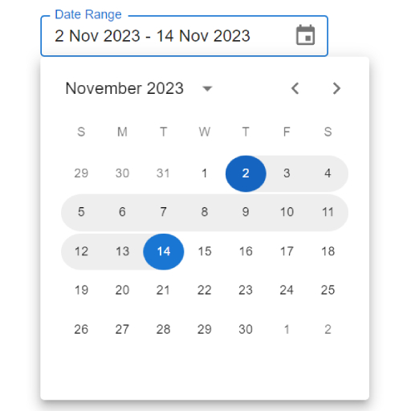

# Date Range Picker

Date Range Picker built with normal **[MUI Date Picker](https://mui.com/x/react-date-pickers/date-picker)**

.

## Description

This Project is built with normal **[MUI Date Picker](https://mui.com/x/react-date-pickers/date-picker)** without using of [MUI Date Range Picker](https://mui.com/x/react-date-pickers/date-range-picker) which is **pro version** and need license to use.

Working principle for selecting dates are nearly similar with [MUI Date Range Picker](https://mui.com/x/react-date-pickers/date-range-picker). But there are some differences. 

e.g. [MUI Date Range Picker](https://mui.com/x/react-date-pickers/date-range-picker) works with 2 input boxes and this project is only work with single input box.

There are some design flaws but it's really OK to be used for normal application.

## Project Setup

Clone the project
```
git clone https://github.com/dev-zha/material-date-range-picker
```
Go to project folder
```
cd material-date-range-picker
```

 Install dependencies.
 ```
 npm install
 ```

Run server:
```
npm  start
```

Open [http://localhost:3000](http://localhost:3000) with your browser to see the result.
